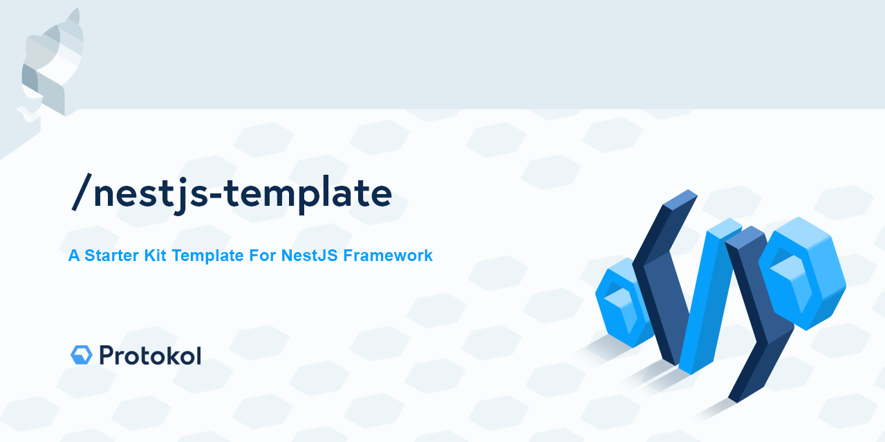

[](https://github.com/protokol/nestjs-template/actions/workflows/tests.yml)

## Description

[Nest](https://github.com/nestjs/nest) framework TypeScript starter repository.

## Requirements

- Node.js `>= 24.9`
- [pnpm](https://pnpm.io/installation) — any recent version; it switches automatically to the version pinned in the `packageManager` field.

## Installation

```bash
$ pnpm install
```

## Running the app

```bash
# development
$ pnpm start

# watch mode
$ pnpm start:dev

# production mode
$ pnpm start:prod
```

## Test

```bash
# unit tests
$ pnpm test

# e2e tests
$ pnpm test:e2e

# test coverage
$ pnpm test:cov
```

## Lint & Format

```bash
# check lint
$ pnpm lint

# fix lint issues
$ pnpm lint:fix

# format with prettier
$ pnpm format
```

## License

This project is [MIT](LICENSE) licensed.
